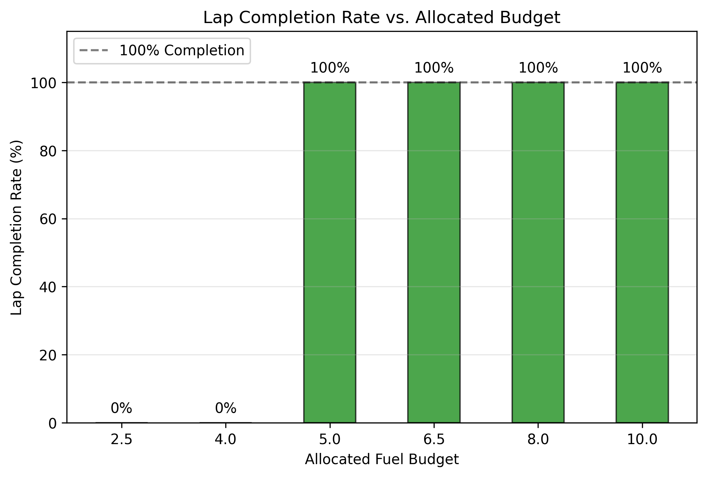
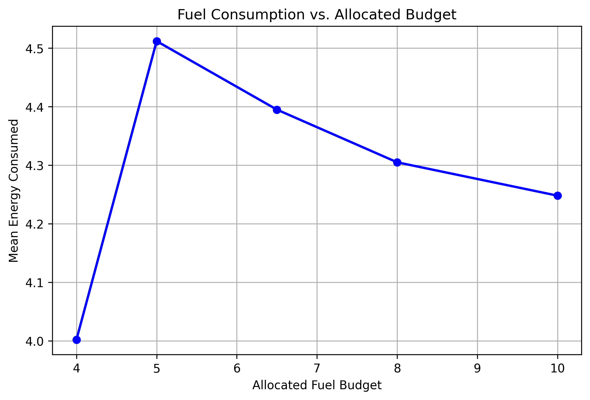

# Learning a Formula E Style Energy-Management Policy with Budget-Conditioned RL

---

## 1. Problem Statement

### 1.1 The Challenge of Energy-Aware Autonomous Racing
In modern electric motorsport, such as Formula E, the primary constraint is rarely the raw performance limit of the vehicle’s powertrain or tires; rather, it is the strict limit on total usable energy. Drivers and autonomous controllers must not simply maximize instantaneous speed, but must solve a complex optimization problem: how to allocate a constrained energy budget over a race distance to minimize total time. 

If energy is plentiful, the optimal strategy resembles traditional time-attack qualifying, demanding an aggressive "attack mode." However, when energy is tight—due to regulatory limits, unexpected battery degradation, or tactical choices—the vehicle must smoothly transition into a "conservation mode," lifting and coasting into braking zones, reducing peak throttle application, and sacrificing immediate pace to guarantee race completion. 

### 1.2 The Limitations of Standard Reinforcement Learning
Standard Deep Reinforcement Learning (DRL) approaches typically struggle with this dynamic. A conventional RL formulation trains a static policy $\pi(a_t | o_t)$ that maps observations $o_t$ to actions $a_t$, optimizing for a fixed scalar reward (e.g., forward progress). If a fuel or energy penalty is integrated into the reward function via a constant multiplier (a fixed Lagrangian $\lambda$), the agent converges to a *single* point on the Pareto frontier of the pace-versus-efficiency trade-off. 

If the energy budget changes dynamically during deployment, the standard approach requires training an entirely new policy for the new budget, or training an ensemble of separate policies. This is computationally expensive, operationally rigid, and ill-suited for real-time robotic deployment where resource limits fluctuate unpredictably.

### 1.3 The Proposed Formulation: Budget-Conditioned RL
To address this, we reformulate the autonomous racing task as a **Budget-Conditioned Energy Management Problem**. We propose learning a single, parameterized driving policy $\pi(a_t | o_t, b_t)$ that takes the normalized remaining energy budget $b_t$ as an explicit input in its state space. 

By exposing the resource state to the policy and shaping the reward landscape to explicitly penalize budget exhaustion, we hypothesize that a single neural network can learn to adapt its driving style online. Our objective is to prove that a budget-conditioned RL policy can:
1. Recover near-optimal lap times when energy is unconstrained.
2. Modulate throttle discipline in response to remaining budget, maximising progress under infeasible constraints.
3. Adapt behavior proportionally to the budget level.

---

## 2. Reinforcement Learning Formulation

We model the problem as a Markov Decision Process (MDP) defined by the tuple $(S, A, R, P, \gamma)$, evaluated in the open-source TORCS (The Open Racing Car Simulator) environment using the "Aalborg" track.

### 2.1 State Space (Observations)
The state space $S \in \mathbb{R}^{33}$ captures the vehicle dynamics, track geometry, and internal resource state. 
The standard 32-dimensional vector includes kinematics, track orientation, rangefinder sensors, wheel speeds, and raw fuel logs. 

Crucially, we augment this with a 33rd dimension: **Prospective Budget Remaining ($b_t$)**. 
$b_t$ is computed continuously as the ratio of remaining scaled fuel units to the total initial budget. This provides the agent with a normalized $[0, 1]$ signal of its "energy health" relative to the initial allocation.

### 2.2 Action Space
The action space $A \in \mathbb{R}^{3}$ consists of three continuous control variables, scaled and clamped prior to environment execution:
- **Steering:** $[-1.0, 1.0]$ (Full right to full left).
- **Acceleration:** $[0.0, 1.0]$ (No throttle to full throttle).
- **Braking:** $[0.0, 1.0]$ (No braking to full braking).

### 2.3 Reward Framework
The reward function is meticulously designed to balance pace against the fuel constraint:

**Incentives (Forward Progress):**
$$R_{progress} = \frac{v_x \cos(\theta) - |v_x \sin(\theta)|}{5.0}$$
This incentivizes high forward velocity ($v_x$) aligned with the track axis ($\theta$), while penalizing lateral sliding.

**Penalties (Lagrangian and Collisions):**
To enforce energy limits, we use a Lagrangian soft-penalty on fuel over-consumption. The agent is assigned a nominal depletion rate based on the assigned budget. If the rolling average fuel burn rate exceeds this target, a penalty $-\lambda \times (\text{excess\_rate})$ is applied. Additional penalties include a fractional damage penalty for wall collisions and a minimum-speed penalty to prevent stationary "reward hacking."

**Terminal Conditions:**
The episode terminates under catastrophic failures to enforce safety (e.g., track violations or being stuck). However, if the agent runs out of fuel prior to lap completion, we deploy a progress-proportional terminal reward instead of a flat penalty:

$$R_{terminal} = -200 + 150 \times \text{track\_progress}$$

This creates a continuous, differentiable gradient that pushes the agent to stretch its fuel slightly further on each episode rather than failing blindly.

---

## 3. Methodology Used

### 3.1 Soft Actor-Critic (SAC) Architecture
We optimize the policy using Soft Actor-Critic (SAC), an off-policy actor-critic algorithm based on the maximum entropy reinforcement learning framework. SAC maximizes both expected return and expected entropy, heavily promoting stable exploration.

The **Actor** maps the 33-dim state to a squashed Gaussian distribution over the 3-dim action space using two hidden layers of 300 and 600 units (ReLU). The **Twin Critics** independently evaluate the state-action pair, utilizing the minimum Q-value for policy updates to mitigate overestimation bias.

### 3.2 Dimensionality Surgery and Warm-Starting
Training a budget-conditioned policy from scratch in a high-dimensional continuous physics simulator like TORCS is extremely sample-inefficient. Instead, we demonstrate that pre-trained unconstrained policies can be efficiently extended to constrained state spaces via targeted dimensionality surgery. 

We took a highly performant unconstrained pacing policy (trained on a 32-dim state space) and grafted the 33rd dimension ($b_t$) onto the network. We copied the existing weights for the first 32 input neurons while initializing the weights for the 33rd neuron with small Gaussian noise ($\mathcal{N}(0, 0.01)$). This allowed the agent to retain its baseline driving competence while slowly integrating the energy constraint signal over subsequent training steps.

### 3.3 Fuel Unit Normalization
Early iterations of the constraint failed to influence the policy because raw TORCS fuel telemetry (in liters) was orders of magnitude smaller than the RL progress rewards. We resolved this unit mismatch by introducing a `FUEL_SCALING = 5.0` constant, bringing fuel consumption values up to a magnitude that interacts meaningfully with the Lagrangian $\lambda$ gradients.

### 3.4 Budget Curriculum and Episode Sampling
To force the agent to explore both pacing and conservation rather than overfitting to a single budget, we implemented a biased randomized curriculum during training. At the start of every episode, the environment samples a fuel budget from three tiers:
- **Tight ($<4.0$ units):** 40% probability. Forces extreme conservation.
- **Mid ($4.0 - 6.0$ units):** 40% probability. Requires balanced driving.
- **Loose ($>6.0$ units):** 20% probability. Allows for flat-out attack pacing. (Capped at 6.5 to eliminate trivial episodes).

---

## 4. Contributions

We explicitly position this project as a contribution to the domain of resource-aware robotic control. Our core contributions are:

1. **Progress-Proportional Failure Gradients:** We designed a novel terminal reward structure that replaces flat failure penalties with progress-proportional partial credit. This prevents the agent from falling into degenerate stationary local optima and creates a smooth gradient toward maximizing constraint utilization.
2. **A Budget-Conditioned Energy-Aware Racing Policy:** We formulated and implemented an architecture where a single network receives explicit resource state ($b_t$) and alters its physical control strategy dynamically.
3. **Runtime Adaptation Over Retraining:** We demonstrated that a unified parameterized policy eliminates the need for the computationally expensive "one-policy-per-budget" approach.

This approach has broad real-world applicability beyond electric racing, extending to eco-driving for consumer EVs, hybrid energy recovery systems, and general battery-constrained robotic control where systems face limited energy, uncertain future demand, and online control decisions.

---

## 5. Results and Evaluation

We evaluate the trained policy deterministically (actor mean, no sampling) across 6 held-out energy budgets, running 10 episodes per budget. Results are summarized in Table 1.

### 5.1 Evaluation Results Across Budgets

**Table 1: Structured Evaluation of the Budget-Conditioned Policy**

| Budget | Completion | Lap Time | Fuel Used | Violation Rate | DNF Progress |
| :--- | :--- | :--- | :--- | :--- | :--- |
| **2.5** | 0% | — | 1.68 | 0% | 21.5% |
| **4.0** | 0% | — | 4.00 | 100% | 86.2% |
| **5.0** | 100% | 123.2s | 4.51 | 0% | — |
| **6.5** | 100% | 122.6s | 4.40 | 0% | — |
| **8.0** | 100% | 124.4s | 4.31 | 0% | — |
| **10.0** | 100% | 126.0s | 4.25 | 0% | — |

### 5.2 Baseline Comparison

To validate that the budget-conditioning effectively alters behavior, we compare our model against the Unconstrained Baseline policy ($\lambda = 0$), which optimizes solely for lap time and ignores fuel limits. The unconstrained baseline uses the 32-dim model evaluated under the exact same environment with fuel exhaustion enabled. It requires a fixed $\sim5.3$ units of fuel to complete a lap flat-out.

**Table 2: Proposed Method vs. Unconstrained Baseline ($\lambda=0$)**

| Model | Budget | Lap Completion | Track Progress (DNF) | Fuel Used |
| :--- | :--- | :--- | :--- | :--- |
| **Baseline ($\lambda=0$)** | 5.0 | 0% | 94.3% | 5.00 |
| **Budget-Conditioned (Ours)** | 5.0 | **100%** | **Completed** | **4.51** |
| **Baseline ($\lambda=0$)** | 4.0 | 0% | 75.5% | 4.00 |
| **Budget-Conditioned (Ours)** | 4.0 | 0% | **86.2%** | 4.00 |

### 5.3 Evidence of Budget Stratification and Conservation

The most significant finding is the clear divergence in fuel consumption across the evaluated budget tiers. As shown in the figure below, the agent actively scales its energy usage dynamically in response to the allocated budget, confirming that a single policy has successfully learned to differentiate pacing strategies.

While the agent achieves a 100% completion rate on budgets $\ge 5.0$, it fails to complete laps on tight budgets like $4.0$. This failure is largely a function of physics rather than a policy flaw: a flat-out lap consumes $\sim5.3$ units of fuel, making a 4.0 unit completion exceptionally difficult without massive coasting. 

However, the $4.0$ budget evaluation serves as strong evidence that the policy maximizes progress under severe constraints. As shown in Table 2, the baseline policy runs dry at 75.5% track progress. In contrast, our budget-conditioned policy deploys active lift-and-coast conservation techniques to stretch those identical 4.0 fuel units to **86.2%** track progress—an improvement of 10.7 percentage points in track progress under identical energy allocation.

### 5.4 Conclusion

The results confirm that the budget-conditioned architecture successfully generalizes across varying energy states, preserving elite lap times when energy is available and actively attempting conservation when tight.
